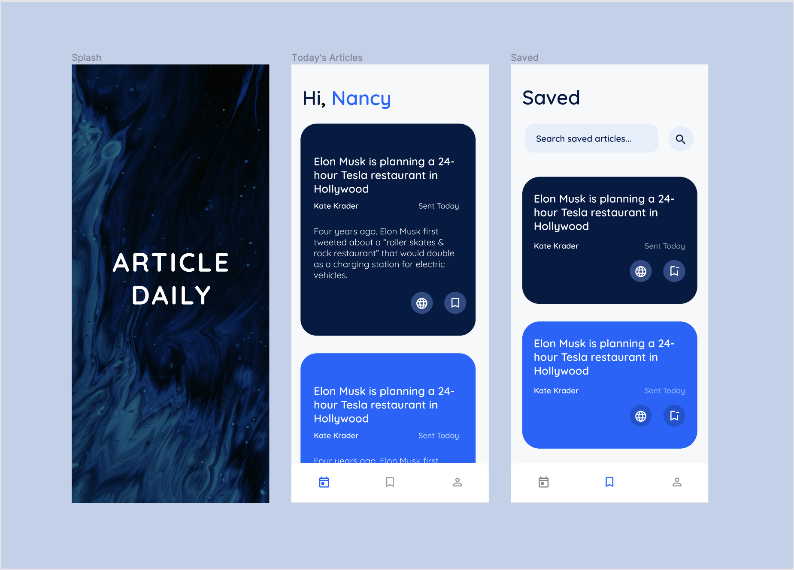

# Article Daily

A news recommendation app built with Flutter.


## Screenshots




## Running


1. Clone the repository

    ```bash
    git clone https://github.com/scorpiobish/article_daily.git
    ```

2. Cd into the folder

    ```bash
    cd article_daily
    ```
       
3. Run the app

    ```bash
    flutter run 
    ```
    
## Author

Nancy Chizea - chizeanancy@gmail.com

Project Link: [https://github.com/scorpiobish/article_daily](https://github.com/scorpiobish/article_daily)


## License

[MIT](https://choosealicense.com/licenses/mit/)

